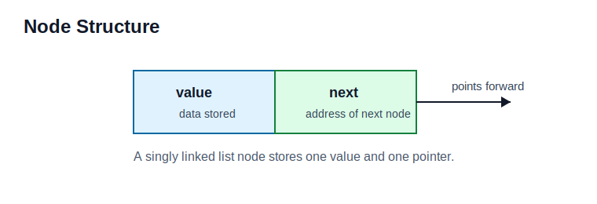
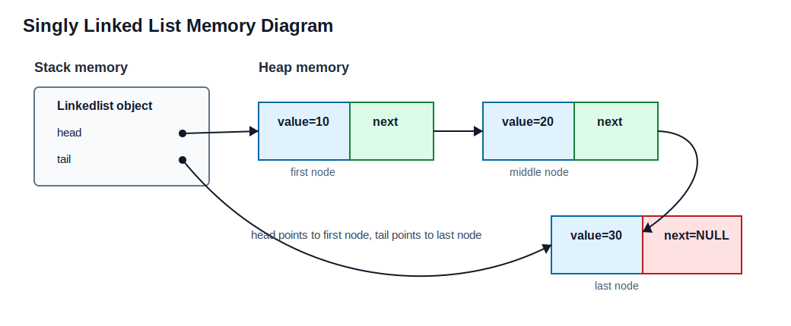
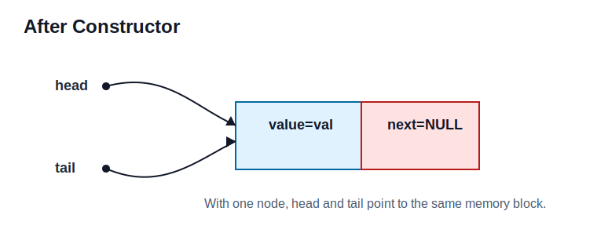
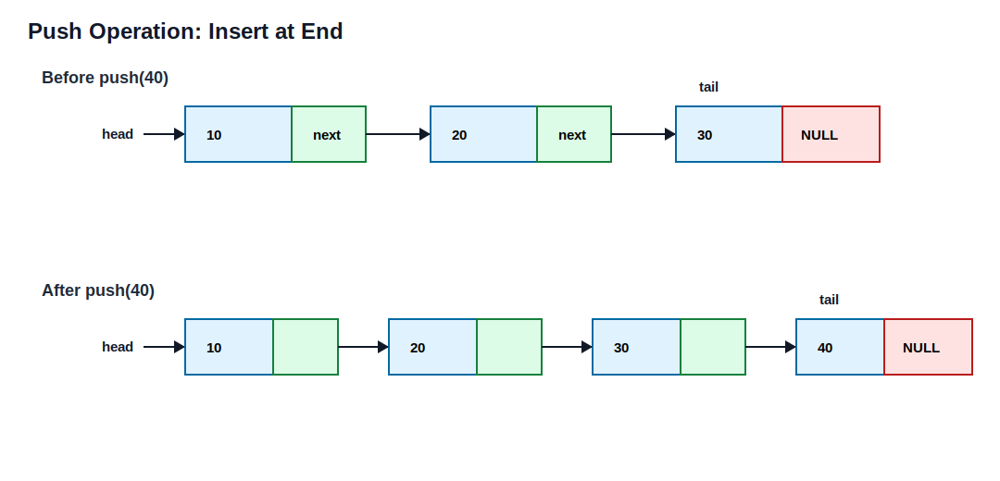
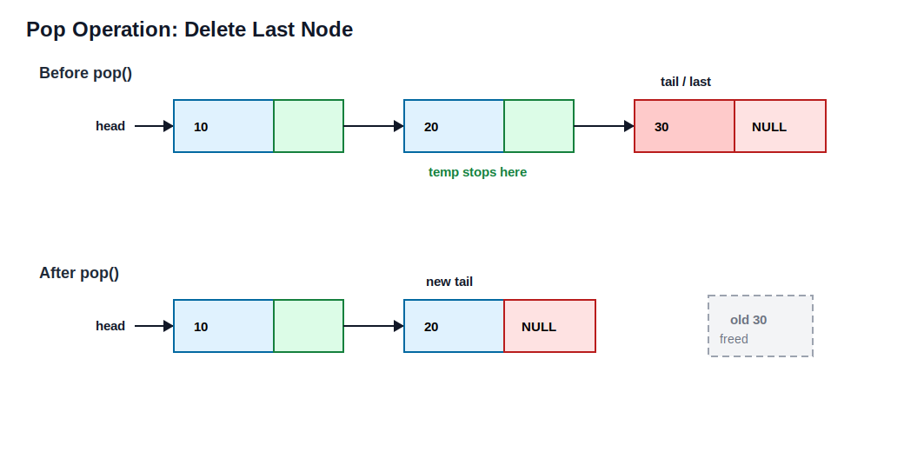
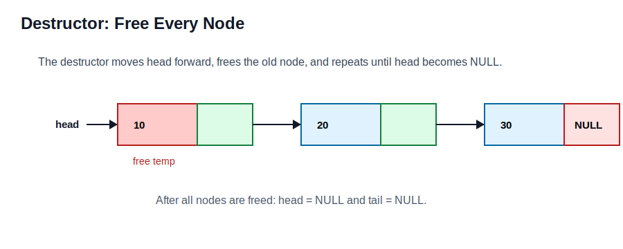

# Singly Linked List Using `malloc()` and `free()`

A **Singly Linked List (SLL)** is a linear dynamic data structure in which each node contains two main parts: a **value** field and a pointer to the **next** node. Unlike an array, a linked list does not store elements in continuous memory locations. Each node is created separately on the heap, and nodes are connected using pointers.

In this implementation, the linked list uses two important pointers:

- `head`: points to the first node of the list.
- `tail`: points to the last node of the list.

Because a singly linked list only stores a `next` pointer, traversal is possible only in the forward direction. We can move from `head` to `tail`, but we cannot directly move backward from `tail` to the previous node.

This design follows the user's code and uses:

- `malloc()` for memory allocation.
- `free()` for memory deallocation.
- No `new`.
- No `delete`.

## Section 1: Public API

The public API is the set of functions that the user can call on the linked list object.

### 1. Constructor

```cpp
Linkedlist(T val);
```

The constructor creates the first node of the linked list. It allocates memory for one node using `malloc()`, stores the given value in that node, sets the node's `next` pointer to `NULL`, and makes both `head` and `tail` point to this first node.

### 2. `push(T val)`

```cpp
void push(T val);
```

The `push()` function inserts a new node at the end of the linked list. Since the list maintains a `tail` pointer, insertion at the end can be done in `O(1)` time.

### 3. `pop()`

```cpp
void pop();
```

The `pop()` function removes the last node from the linked list. Since this is a singly linked list, the previous node of `tail` cannot be found directly. Therefore, the list must be traversed from `head` until the node before `tail` is found.

Because of this, `pop()` takes `O(n)` time.

### 4. `traverse()`

```cpp
void traverse();
```

The `traverse()` function starts from `head` and prints every node's value until it reaches `NULL`.

In the user's code, the function name is written as:

```cpp
tarverse();
```

The correct spelling should be:

```cpp
traverse();
```

### 5. Destructor

```cpp
~Linkedlist();
```

The destructor releases all nodes from heap memory using `free()`. It starts from `head`, stores the current node in a temporary pointer, moves `head` to the next node, and frees the old node.

This prevents memory leaks.

## Section 2: Internal Representation

## Node Class

The `Node` class is the basic building block of the singly linked list.

```cpp
template<typename T>
class Node {
public:
    Node<T>* next;
    T value;
};
```

Each node contains:

- `value`: stores the data.
- `next`: stores the address of the next node.

Memory view of one node:



If `next` is `NULL`, that node is the last node of the list.

## Linkedlist Class

```cpp
template<typename T>
class Linkedlist {
public:
    Node<T>* head;
    Node<T>* tail;
};
```

The linked list object itself stores only the addresses of the first and last nodes. The actual nodes are dynamically allocated on the heap.



Here:

- `head` points to the first node.
- `tail` points to the last node.
- Every node is allocated using `malloc()`.
- Every node must later be released using `free()`.

## Section 3: Constructor Logic

User code:

```cpp
Linkedlist(T val) {
    head = (Node<T>*)malloc(sizeof(Node<T>));
    head->value = val;
    head->next = NULL;
    tail = head;
}
```

Step-by-step explanation:

1. Memory is allocated for one node.
2. The value is stored in the node.
3. The node's `next` pointer is set to `NULL`.
4. `head` points to this node.
5. `tail` also points to this node because there is only one node.

Memory diagram after constructor:



Improved version with allocation check:

```cpp
Linkedlist(T val) {
    head = (Node<T>*)malloc(sizeof(Node<T>));

    if (head == NULL) {
        cout << "memory allocation failed";
        tail = NULL;
        return;
    }

    head->value = val;
    head->next = NULL;
    tail = head;
}
```

## Section 4: Push Operation

User code:

```cpp
void push(T val) {
    tail->next = (Node<T>*)malloc(sizeof(Node<T>));
    tail = tail->next;
    tail->next = NULL;
    tail->value = val;
}
```

The `push()` function inserts a new node at the end.

Before `push(40)`:



After `push(40)`:

The same diagram above shows how the new node is attached after the old tail and how `tail` is moved to the new node.

Improved version with allocation check:

```cpp
void push(T val) {
    Node<T>* newNode = (Node<T>*)malloc(sizeof(Node<T>));

    if (newNode == NULL) {
        cout << "memory allocation failed";
        return;
    }

    newNode->value = val;
    newNode->next = NULL;

    if (head == NULL) {
        head = newNode;
        tail = newNode;
        return;
    }

    tail->next = newNode;
    tail = newNode;
}
```

## Section 5: Pop Operation

User code:

```cpp
void pop() {
    if (head == NULL) {
        cout << "underflow";
        return;
    }

    if (head == tail) {
        free(head);
        head = NULL;
        tail = NULL;
        return;
    }

    Node<T>* temp = head;
    Node<T>* last = tail;

    while (temp->next != tail) {
        temp = temp->next;
    }

    temp->next = NULL;
    tail = temp;
    free(last);
}
```

### Case 1: Empty List

If `head == NULL`, the list has no nodes.

At this point, `head = NULL` and `tail = NULL`.

Calling `pop()` here causes underflow because there is nothing to delete.

### Case 2: Only One Node

Before `pop()`:


After `pop()`:

After deleting the only node, `head = NULL` and `tail = NULL`.

The only node is freed using `free()`.

### Case 3: More Than One Node

Before `pop()`:



The node before `tail` must be found by traversal.

After `pop()`:

The same diagram above shows that the old tail node is detached and freed, while the previous node becomes the new tail.

The old tail node containing `30` is freed.

## Section 6: Traverse Operation

User code:

```cpp
void tarverse() {
    Node<T>* temp = head;

    while (temp != NULL) {
        cout << temp->value << " ";
        temp = temp->next;
    }
}
```

Traversal starts from `head` and follows `next` pointers until `NULL`.

Example:


Output:

`10 20 30`

Recommended spelling:

```cpp
void traverse() {
    Node<T>* temp = head;

    while (temp != NULL) {
        cout << temp->value << " ";
        temp = temp->next;
    }
}
```

## Section 7: Destructor

User code:

```cpp
~Linkedlist() {
    while (head != NULL) {
        Node<T>* temp = head;
        head = head->next;
        free(temp);
    }
}
```

The destructor frees every node one by one.

Before destructor:



Step-by-step:

1. Store current `head` in `temp`.
2. Move `head` to the next node.
3. Free `temp`.
4. Repeat until `head == NULL`.

After destructor:

After the destructor finishes, `head = NULL` and `tail` should also be treated as invalid. In the improved version, `tail` is explicitly set to `NULL`.

Improved destructor:

```cpp
~Linkedlist() {
    while (head != NULL) {
        Node<T>* temp = head;
        head = head->next;
        free(temp);
    }

    tail = NULL;
}
```

## Section 8: Complexity Estimates

| Operation | Time Complexity | Reason |
|---|---:|---|
| Constructor | `O(1)` | Only one node is created. |
| `push(T val)` | `O(1)` | `tail` gives direct access to the end. |
| `pop()` | `O(n)` | The previous node of `tail` must be found from `head`. |
| `traverse()` | `O(n)` | Every node is visited once. |
| Destructor | `O(n)` | Every node must be freed. |

## Section 9: Important Issue With `malloc()` in C++

This is the most important issue in the user's code.

The code uses:

```cpp
Linkedlist<string> lst("naman");
```

But nodes are allocated using:

```cpp
head = (Node<T>*)malloc(sizeof(Node<T>));
```

`malloc()` only allocates raw memory. It does not call constructors.

This means if `T` is `string`, the `string` object inside the node is not properly created. Therefore this line is unsafe:

```cpp
head->value = val;
```

Similarly, `free()` only releases memory. It does not call destructors. So if the node contains a `string`, the internal memory owned by the string may not be cleaned correctly.

Therefore:

```cpp
Linkedlist<int>
```

is suitable for this `malloc()` and `free()` implementation.

But:

```cpp
Linkedlist<string>
```

is not safe with plain `malloc()` and `free()`.

In real C++ code, `string` and class objects should normally be handled using `new` and `delete`, or better, smart pointers. However, if the requirement is strictly to use `malloc()` and `free()`, then the safest choice is to store simple data types such as `int`, `char`, `float`, or plain structs without constructors and destructors.

## Section 10: Corrected Code Based on User's Implementation

This version keeps the same idea as the user's code but improves spelling and checks whether `malloc()` succeeded.

```cpp
#include <iostream>
#include <cstdlib>
using namespace std;

template<typename T>
class Node {
public:
    Node<T>* next;
    T value;
};

template<typename T>
class Linkedlist {
public:
    Node<T>* head;
    Node<T>* tail;

    Linkedlist(T val) {
        head = (Node<T>*)malloc(sizeof(Node<T>));

        if (head == NULL) {
            cout << "memory allocation failed";
            tail = NULL;
            return;
        }

        head->value = val;
        head->next = NULL;
        tail = head;
    }

    void push(T val) {
        Node<T>* newNode = (Node<T>*)malloc(sizeof(Node<T>));

        if (newNode == NULL) {
            cout << "memory allocation failed";
            return;
        }

        newNode->value = val;
        newNode->next = NULL;

        if (head == NULL) {
            head = newNode;
            tail = newNode;
            return;
        }

        tail->next = newNode;
        tail = newNode;
    }

    void pop() {
        if (head == NULL) {
            cout << "underflow";
            return;
        }

        if (head == tail) {
            free(head);
            head = NULL;
            tail = NULL;
            return;
        }

        Node<T>* temp = head;
        Node<T>* last = tail;

        while (temp->next != tail) {
            temp = temp->next;
        }

        temp->next = NULL;
        tail = temp;
        free(last);
    }

    void traverse() {
        Node<T>* temp = head;

        while (temp != NULL) {
            cout << temp->value << " ";
            temp = temp->next;
        }
    }

    ~Linkedlist() {
        while (head != NULL) {
            Node<T>* temp = head;
            head = head->next;
            free(temp);
        }

        tail = NULL;
    }
};

int main() {
    Linkedlist<int> lst(10);
    lst.push(20);
    lst.push(30);
    lst.traverse();

    return 0;
}
```

## Section 11: Design Decision

## Why Singly Linked List Is Used

A singly linked list is used because it is simple and memory-efficient. Each node stores only one pointer, `next`, so it requires less memory than a doubly linked list. This is useful when forward traversal is enough.

In this implementation, the `tail` pointer is also maintained. Because of this, insertion at the end using `push()` becomes efficient and takes `O(1)` time.

The main limitation is deletion from the end. Since there is no `prev` pointer, the previous node of `tail` cannot be found directly. So `pop()` must traverse from `head`, making it an `O(n)` operation.

## Why `head` and `tail` Are Maintained

Maintaining both `head` and `tail` improves the linked list design:

- `head` allows traversal from the beginning.
- `tail` allows fast insertion at the end.
- If only `head` were maintained, `push()` would require traversal to the last node every time.

With `tail`, `push()` is `O(1)` instead of `O(n)`.

## Why `malloc()` and `free()` Are Used

`malloc()` and `free()` are used because the requirement is to allocate memory manually without using `new` and `delete`.

However, this style is closer to C than modern C++. It should be used carefully in C++ because constructors and destructors are not automatically called.

## Final Notes

The algorithm and pointer logic in the user's linked list are mostly correct. The main improvements are:

- Check if `malloc()` fails.
- Use `traverse()` instead of `tarverse()`.
- Avoid `Linkedlist<string>` when using plain `malloc()` and `free()`.
- Use simple types like `int` for this implementation.
- Free all nodes in the destructor to prevent memory leaks.
